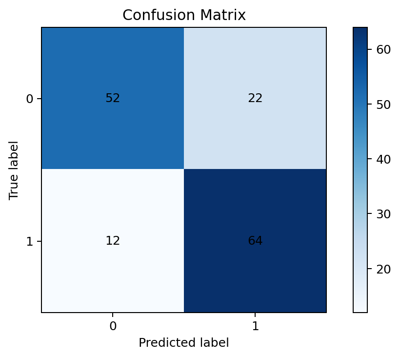
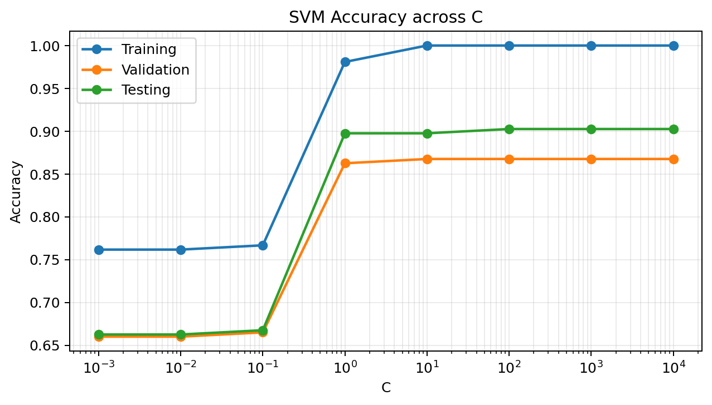
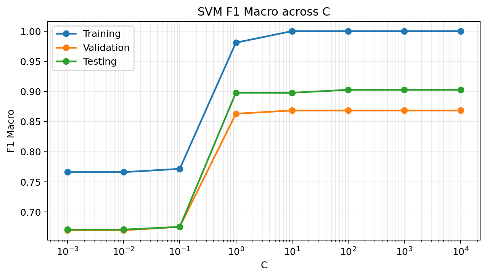
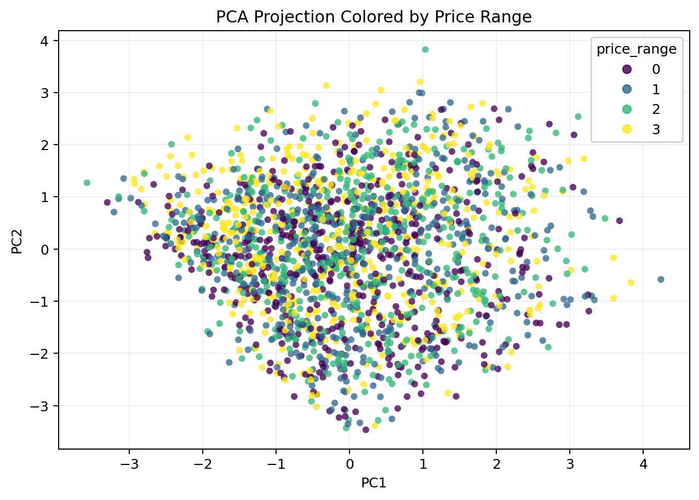
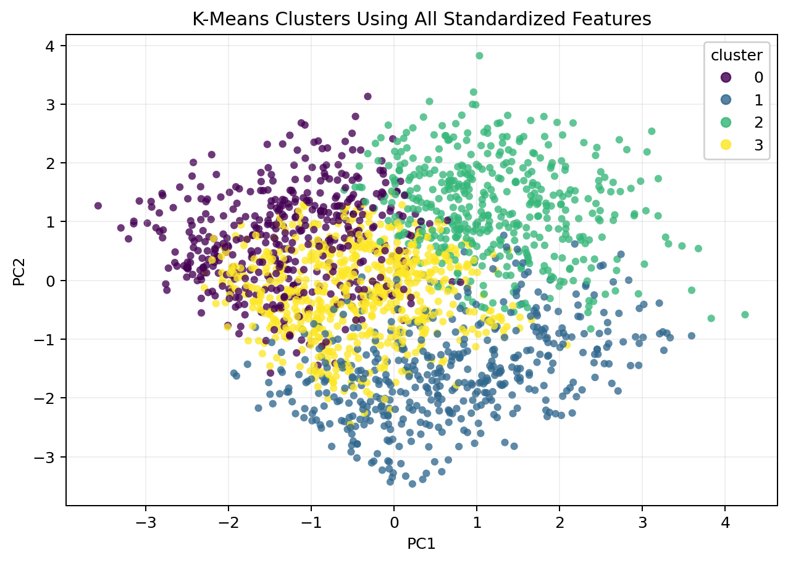
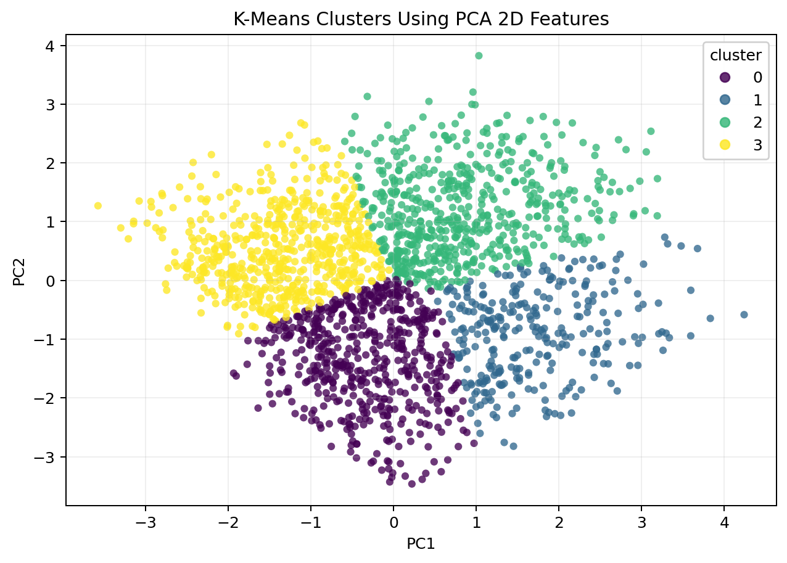
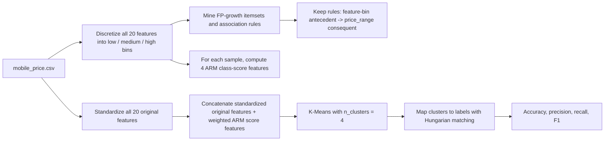

# Data Mining Assignment 2

Student ID: 314554024

GitHub repository: https://github.com/skyhong2002/DM2026-Assignment-2

## Question 1: K-fold Cross-Validation

This question continues the real-world binary classification task from Assignment 1. I reused the Assignment 1 Question 3 preprocessing pipeline:

1. Strip and label-encode `Species` as the binary target.
2. Convert all feature columns except `Id` and `Species` to numeric values.
3. Apply `KNNImputer(n_neighbors=5)` to fill missing feature values.
4. Apply min-max normalization to each feature.
5. Split the processed data into training and testing data using `train_test_split(test_size=0.3, random_state=40)`.

The experiment code is in `scripts/q1_cross_validation.py`. The model code uses the updated `model/linear_model.py` interface from the Assignment 1 repository so that `cross_val_score` can clone and evaluate the model.

### 1(a) 5-Fold Cross-Validation Results

I used `KFold(n_splits=5, shuffle=True, random_state=40)` and `cross_val_score` on the training data. Each model was trained with L2 regularization for 10,000 iterations.

| learning_rate | lambda_1 | lambda_2 | lambda_4 | lambda_8 |
| --- | --- | --- | --- | --- |
| 0.0050 | 0.7143 | 0.7171 | 0.7229 | 0.7286 |
| 0.0100 | 0.7257 | 0.7400 | 0.7400 | 0.7257 |
| 0.1000 | 0.7343 | 0.7343 | 0.7400 | 0.7257 |
| 0.5000 | 0.7343 | 0.7229 | 0.5429 | 0.4629 |

### 1(b) Testing Results for the Top Two Settings

Several settings tied at the best average cross-validation accuracy of `0.7400`. To select two reproducibly, I sorted by higher average CV accuracy, then lower CV standard deviation, then smaller learning rate and lambda. The selected top two settings were `lr=0.1, reg_lambda=4.0` and `lr=0.01, reg_lambda=4.0`.

| learning_rate | reg_lambda | cv_avg_accuracy | Accuracy | Precision | Recall | F1-score |
| --- | --- | --- | --- | --- | --- | --- |
| 0.1000 | 4.0000 | 0.7400 | 0.7667 | 0.7412 | 0.8289 | 0.7826 |
| 0.0100 | 4.0000 | 0.7400 | 0.7733 | 0.7442 | 0.8421 | 0.7901 |

Confusion matrix outputs:

### 1(c) Observations

The cross-validation results show that moderate learning rates and regularization strengths work best for this preprocessed dataset. The best average CV accuracy is reached by multiple settings around `reg_lambda=2` or `reg_lambda=4`, while the very large learning rate with stronger regularization (`lr=0.5`, `lambda=4` or `8`) performs much worse.

On the testing data, the two selected models have similar behavior. The `lr=0.01, reg_lambda=4.0` model gives slightly better testing accuracy and F1-score than `lr=0.1, reg_lambda=4.0`, even though both have the same average CV accuracy. This suggests that cross-validation is useful for narrowing down good hyperparameter regions, but small differences among tied settings should still be checked on the held-out test set.

## Question 2: SVM

The `mobile_price.csv` dataset contains 2,000 samples, 20 feature columns, and one target column `price_range`. The four classes are balanced, with 500 samples in each class. I split the dataset into training, validation, and testing sets with a 60% / 20% / 20% ratio using random seed 42. Since SVM is distance-based and sensitive to feature scales, I used a `StandardScaler` inside an sklearn pipeline before `SVC`.

The experiment code is in `scripts/q2_svm.py`. I report macro F1-score because `price_range` is a four-class target.

### 2(a) SVM Results with `C=1.0`

| C | split | accuracy | f1_macro |
| --- | --- | --- | --- |
| 1.0000 | training | 0.9808 | 0.9809 |
| 1.0000 | validation | 0.8625 | 0.8630 |
| 1.0000 | testing | 0.8975 | 0.8979 |

### 2(b) SVM Performance with Different `C`

Accuracy:

| C | testing | training | validation |
| --- | --- | --- | --- |
| 0.0010 | 0.6625 | 0.7617 | 0.6600 |
| 0.0100 | 0.6625 | 0.7617 | 0.6600 |
| 0.1000 | 0.6675 | 0.7667 | 0.6650 |
| 1.0000 | 0.8975 | 0.9808 | 0.8625 |
| 10.0000 | 0.8975 | 1.0000 | 0.8675 |
| 100.0000 | 0.9025 | 1.0000 | 0.8675 |
| 1000.0000 | 0.9025 | 1.0000 | 0.8675 |
| 10000.0000 | 0.9025 | 1.0000 | 0.8675 |

Macro F1-score:

| C | testing | training | validation |
| --- | --- | --- | --- |
| 0.0010 | 0.6707 | 0.7660 | 0.6696 |
| 0.0100 | 0.6707 | 0.7660 | 0.6696 |
| 0.1000 | 0.6752 | 0.7715 | 0.6753 |
| 1.0000 | 0.8979 | 0.9809 | 0.8630 |
| 10.0000 | 0.8978 | 1.0000 | 0.8683 |
| 100.0000 | 0.9026 | 1.0000 | 0.8683 |
| 1000.0000 | 0.9026 | 1.0000 | 0.8683 |
| 10000.0000 | 0.9026 | 1.0000 | 0.8683 |

### 2(c) Best Generalization Setting

Based on validation macro F1-score, the best group is `C = 10, 100, 1000, 10000`, all with validation macro F1 around `0.8683`. I choose `C=10` as the best generalization setting because it reaches the highest validation performance while using the smallest C among the tied settings. Larger C values produce the same validation score and fully fit the training set, so they do not provide a meaningful generalization benefit.

The very small C values (`0.001`, `0.01`, `0.1`) underfit the data, with both validation and testing accuracy around 0.66. Increasing C to `1.0` greatly improves all metrics, and increasing it further gives only a small validation improvement while training accuracy becomes perfect.

## Question 3: Association Rule Mining

For this question, I first filtered the dataset to keep only samples with `price_range = 1`, which gives 500 transactions. I then used the four required features: `ram`, `int_memory`, `px_width`, and `battery_power`. For each feature, I computed the min and max within the filtered data and split the range into low / medium / high using a 3:4:3 ratio.

The experiment code is in `scripts/q3_association_rules.py`.

Feature thresholds:

| feature | min | low_upper | high_lower | max |
| --- | --- | --- | --- | --- |
| ram | 387 | 1114.2000 | 2083.8000 | 2811 |
| int_memory | 2 | 20.6000 | 45.4000 | 64 |
| px_width | 500 | 949.4000 | 1548.6000 | 1998 |
| battery_power | 501 | 949.5000 | 1547.5000 | 1996 |

### 3(a) Frequent Patterns with Support >= 0.3

| support | itemsets | length |
| --- | --- | --- |
| 0.6820 | ram_medium | 1 |
| 0.4160 | px_width_medium | 1 |
| 0.4140 | battery_power_medium | 1 |
| 0.4120 | int_memory_medium | 1 |
| 0.3160 | int_memory_low | 1 |
| 0.3080 | battery_power_low | 1 |
| 0.3180 | battery_power_medium, ram_medium | 2 |
| 0.3060 | px_width_medium, ram_medium | 2 |

### 3(b) Association Rules

The following rules satisfy support >= 0.3, confidence >= 0.4, and lift >= 0.8.

| antecedents | consequents | support | confidence | lift | leverage | conviction |
| --- | --- | --- | --- | --- | --- | --- |
| battery_power_medium | ram_medium | 0.3180 | 0.7681 | 1.1263 | 0.0357 | 1.3714 |
| ram_medium | battery_power_medium | 0.3180 | 0.4663 | 1.1263 | 0.0357 | 1.0979 |
| px_width_medium | ram_medium | 0.3060 | 0.7356 | 1.0786 | 0.0223 | 1.2026 |
| ram_medium | px_width_medium | 0.3060 | 0.4487 | 1.0786 | 0.0223 | 1.0593 |

### 3(c) Observations

The most common single item is `ram_medium`, with support `0.6820`, meaning medium RAM appears in more than two-thirds of the `price_range = 1` phones after the 3:4:3 binning. The other frequent single items are mostly medium-level hardware settings, except for `int_memory_low` and `battery_power_low`.

Only two frequent two-item patterns reach support 0.3: `battery_power_medium, ram_medium` and `px_width_medium, ram_medium`. The association rules also center on `ram_medium`. Both lifts are above 1, so these combinations occur slightly more often than expected under independence, but the lift values are not very large. This suggests that for low-mid price phones (`price_range = 1`), medium RAM is a common anchor feature, while battery power and pixel width provide weaker but still positive associations.

## Question 4: PCA and K-Means

The experiment code is in `scripts/q4_pca_kmeans.py`.

### 4(a) Feature Standardization

I split `mobile_price.csv` into feature matrix `X` and label vector `y = price_range`. I standardized all 20 feature columns using z-score standardization with `StandardScaler`, so each feature has approximately mean 0 and standard deviation 1 before PCA and K-Means.

### 4(b) PCA Projection to 2D

I applied PCA to the standardized feature matrix and projected the data to two dimensions.

| component | explained_variance_ratio |
| --- | --- |
| PC1 | 0.0839 |
| PC2 | 0.0811 |
| PC1+PC2 | 0.1650 |

### 4(c) K-Means Using All Standardized Features

I applied K-Means with `n_clusters=4` to all 20 standardized features. The clustering result is visualized on the PCA plane, and performance is evaluated with Adjusted Rand Index (ARI).

| method | n_features | adjusted_rand_score |
| --- | --- | --- |
| KMeans on all standardized features | 20 | 0.0060 |

### 4(d) K-Means Using 2D PCA Features

I then applied K-Means with `n_clusters=4` using only the 2D PCA features.

| method | n_features | adjusted_rand_score |
| --- | --- | --- |
| KMeans on 2D PCA features | 2 | 0.0017 |

### 4(e) Observations

The first two principal components explain only about `16.50%` of the total variance, so the 2D PCA plot loses most of the feature-space information. In the class-colored PCA scatter plot, the four price ranges overlap heavily instead of forming clearly separated regions.

Both K-Means results have ARI values close to zero. K-Means on all standardized features performs slightly better (`ARI = 0.0060`) than K-Means on 2D PCA features (`ARI = 0.0017`), but both are very weak. This suggests that the natural Euclidean clusters found by K-Means do not align well with the supervised `price_range` labels. The target is likely driven by feature combinations such as RAM and other specifications rather than by four spherical unsupervised clusters.

## Question 5: Enhancing K-Means Clustering with Association Rule Mining

The experiment code is in `scripts/q5_arm_kmeans.py`.

### Method Design

The original K-Means baseline uses all 20 standardized features directly. However, Q4 showed that ordinary Euclidean clusters do not align well with `price_range`. My improvement is an association-rule-guided K-Means method. The main idea is to use association rule mining to extract label-related feature patterns, then inject those patterns back into the clustering feature space.

This is a semi-supervised enhancement: association rules are mined with `price_range` as the consequent, while K-Means is still used as the final clustering algorithm.

Detailed steps:

1. Standardize all original features using `StandardScaler`.
2. Discretize every feature into `low`, `medium`, and `high` using the 3:4:3 range split.
3. Build transactions containing all feature-bin items plus one label item such as `price_range_0`.
4. Use FP-growth and association rules to find rules whose consequent is exactly one `price_range` item.
5. For each sample, compute four rule-score features. If the sample satisfies a rule antecedent, the score of the rule's consequent class is increased by `support * confidence * lift`.
6. Concatenate the original standardized features with weighted ARM score features.
7. Run K-Means with seeds `[0, 10, 42, 100, 999]`.
8. Map cluster IDs to class labels using Hungarian matching before computing accuracy, macro precision, macro recall, and macro F1-score.

The design is inspired by associative classification: class association rules can capture interpretable feature-label patterns, and these patterns can be used as additional representation features. In this dataset, rules involving `ram_low` and `ram_high` are especially informative.

Top mined label association rules:

| antecedents | consequents | support | confidence | lift | rule_score |
| --- | --- | --- | --- | --- | --- |
| ram_low | price_range_0 | 0.2305 | 0.7632 | 3.0530 | 0.5371 |
| ram_high | price_range_3 | 0.2250 | 0.7679 | 3.0717 | 0.5307 |
| px_height_low, ram_low | price_range_0 | 0.1375 | 0.8929 | 3.5714 | 0.4385 |
| ram_high, three_g_high | price_range_3 | 0.1735 | 0.7851 | 3.1403 | 0.4277 |
| ram_low, three_g_high | price_range_0 | 0.1735 | 0.7728 | 3.0913 | 0.4145 |
| fc_low, ram_low | price_range_0 | 0.1595 | 0.7705 | 3.0821 | 0.3788 |
| fc_low, ram_high | price_range_3 | 0.1530 | 0.7786 | 3.1145 | 0.3710 |
| four_g_high, ram_high | price_range_3 | 0.1240 | 0.8105 | 3.2418 | 0.3258 |

### Experimental Results

Per-seed results:

| method | seed | accuracy | precision_macro | recall_macro | f1_macro |
| --- | --- | --- | --- | --- | --- |
| Original KMeans | 0 | 0.2945 | 0.2940 | 0.2945 | 0.2926 |
| Original KMeans | 10 | 0.2955 | 0.2953 | 0.2955 | 0.2936 |
| Original KMeans | 42 | 0.2970 | 0.2966 | 0.2970 | 0.2950 |
| Original KMeans | 100 | 0.2955 | 0.2950 | 0.2955 | 0.2935 |
| Original KMeans | 999 | 0.2985 | 0.2984 | 0.2985 | 0.2956 |
| ARM-guided KMeans | 0 | 0.6765 | 0.6558 | 0.6765 | 0.6601 |
| ARM-guided KMeans | 10 | 0.6760 | 0.6551 | 0.6760 | 0.6596 |
| ARM-guided KMeans | 42 | 0.6785 | 0.6581 | 0.6785 | 0.6624 |
| ARM-guided KMeans | 100 | 0.6775 | 0.6569 | 0.6775 | 0.6613 |
| ARM-guided KMeans | 999 | 0.6775 | 0.6569 | 0.6775 | 0.6613 |

Average performance across the five required seeds:

| method | accuracy | precision_macro | recall_macro | f1_macro |
| --- | --- | --- | --- | --- |
| ARM-guided KMeans | 0.6772 | 0.6566 | 0.6772 | 0.6609 |
| Original KMeans | 0.2962 | 0.2959 | 0.2962 | 0.2941 |

Standard deviation across seeds:

| method | accuracy | precision_macro | recall_macro | f1_macro |
| --- | --- | --- | --- | --- |
| ARM-guided KMeans | 0.0010 | 0.0012 | 0.0010 | 0.0011 |
| Original KMeans | 0.0016 | 0.0017 | 0.0016 | 0.0012 |

### Analysis

The original K-Means baseline performs poorly, with average macro F1-score around `0.2941`. This is consistent with Q4: the raw standardized feature space does not naturally separate into clusters matching the four price ranges.

The ARM-guided method improves average macro F1-score to `0.6609`. The improvement comes from adding rule-score features that summarize class-associated feature patterns. For example, `ram_low -> price_range_0` and `ram_high -> price_range_3` have high lift values, so the additional ARM features make samples with similar price-related rule evidence closer in the K-Means feature space.

The low standard deviations show that both methods are stable across the required seeds. The ARM-guided method is consistently better for every seed, indicating that the improvement is not caused by a lucky K-Means initialization.
